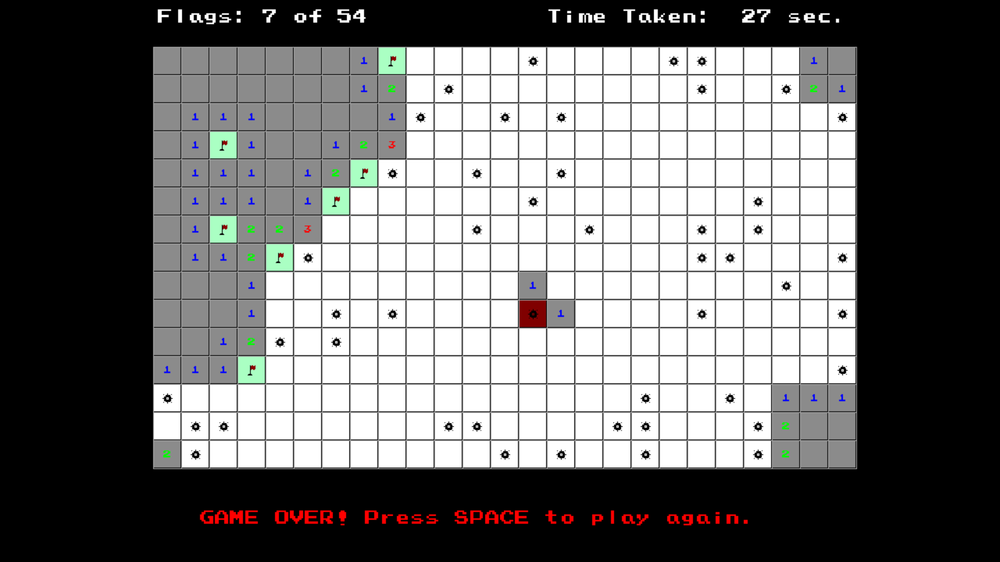

# Minesweeper for `vbPixelGameEngine`



## Overview
This is a Minesweeper clone for `vbPixelGameEngine`, which features a 25x15 grid with 54 mines. The game itself brings the nostalgia of the classic Minesweeper game.

The player can reveal cells by left-clicking on them. If a cell is revealed and contains a mine, the game ends. If a cell is revealed and does not contain a mine, it will show the number of mines in the adjacent cells. The player can flag cells by right-clicking on them. The goal is to flag all cells that contain mines without revealing any cells with mines.

Patterns of mines, flags, and wrong marks are defined in the [Patterns.yml](Assets/Patterns.yml) file. Background music is sourced from the GameBoy version of "Minesweeper".

## Prerequisites
- [**.NET SDK**](https://dotnet.microsoft.com/en-us/download/dotnet/9.0): version 9.0 or higher
- **IDE**: Visual Studio 2022/2026 or Visual Studio Code.

## How to Play
1. Clone the repository and navigate to the project directory:
````
git clone https://github.com/Pac-Dessert1436/VBPGE-Minesweeper.git
cd VBPGE-Minesweeper
````
2. Restore the project dependencies using the `dotnet restore` command.
3. Compile and run the project with the `dotnet run` command, or the "Run" button in Visual Studio 2022/2026.
4. Gameplay Instructions:
    - Left-click the mouse to reveal cells.
    - Right-click the mouse to flag mines.
    - Try to flag all mines without revealing any cells with mines.

## License
The project is licensed under the MIT License. See the [LICENSE](LICENSE) file for more details.